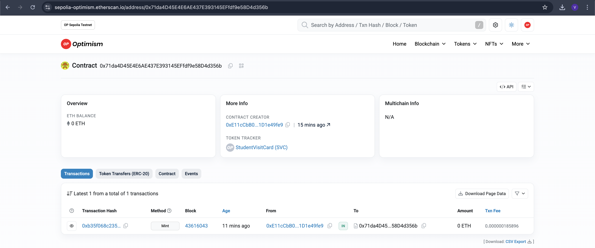
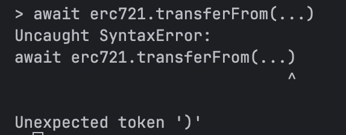
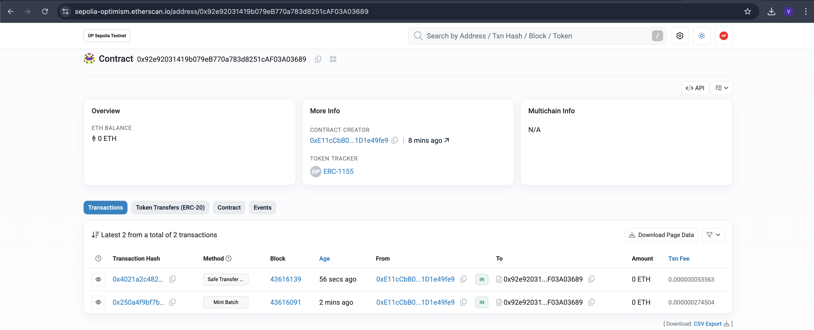

# ERC-721 Soulbound Student Card & ERC-1155 Game Character Collection

## Project Overview

This project contains two NFT smart contracts developed with Solidity and Hardhat:

1. **SoulboundVisitCardERC721**
    - Non-transferable ERC-721 NFT
    - Represents a student visit card
    - Only admin can mint
    - Each student receives exactly one NFT

2. **GameCharacterCollectionERC1155**
    - ERC-1155 game character collection
    - Contains 10 different character NFTs
    - Supports batch minting and batch transfers

---

# Technologies Used

- Solidity 0.8.x
- Hardhat
- OpenZeppelin Contracts
- MetaMask
- IPFS / Pinata
- Optimism Sepolia Testnet

---

# Project Structure

```text
my-token-project/
│
├── contracts/
│   ├── SoulboundVisitCardERC721.sol
│   └── GameCharacterCollectionERC1155.sol
│
├── scripts/
│   ├── deploy721.js
│   └── deploy1155.js
│
├── metadata/
│   ├── soulbound/
│   ├── game/
│   └── images/
│
├── hardhat.config.js
├── package.json
└── README.md
```

---

# How to Deploy the Contracts

## 1. Install Dependencies

Run:

```bash
npm install
```

---

## 2. Compile Contracts

Run:

```bash
npx hardhat compile
```

---

## 3. Configure Environment Variables

Create a `.env` file:

```env
PRIVATE_KEY=YOUR_METAMASK_PRIVATE_KEY
RPC_URL=https://sepolia.optimism.io
```

---

## 4. Configure `hardhat.config.js`

Example:

```javascript
require("@nomiclabs/hardhat-ethers");
require("dotenv").config();

module.exports = {
  solidity: "0.8.24",
  networks: {
    op_sepolia: {
      url: process.env.RPC_URL,
      accounts: [process.env.PRIVATE_KEY]
    }
  }
};
```

---

# Deploy ERC-721 Soulbound Contract

Run:

```bash
npx hardhat run scripts/deploy721.js --network op_sepolia
```

Save the deployed contract address.

---

# Deploy ERC-1155 Contract

Run:

```bash
npx hardhat run scripts/deploy1155.js --network op_sepolia
```

Save the deployed contract address.

---

# How to Mint the Soulbound Visit Card NFT

Open Hardhat console:

```bash
npx hardhat console --network op_sepolia
```

Connect to the deployed contract:

```javascript
const contract = await ethers.getContractAt(
  "SoulboundVisitCardERC721",
  "PASTE_ERC721_CONTRACT_ADDRESS"
);
```

Mint NFT to student wallet:

```javascript
await contract.mint(
  "STUDENT_WALLET_ADDRESS",
  "ipfs://YOUR_SOULBOUND_METADATA_CID/student1.json"
);
```

Verify owner:

```javascript
await contract.ownerOf(1);
```

---

# How to Mint ERC-1155 Game Character NFTs

Open Hardhat console:

```bash
npx hardhat console --network op_sepolia
```

Connect to ERC-1155 contract:

```javascript
const contract = await ethers.getContractAt(
  "GameCharacterCollectionERC1155",
  "PASTE_ERC1155_CONTRACT_ADDRESS"
);
```

Batch mint 10 NFTs:

```javascript
await contract.mintBatch(
  "YOUR_WALLET_ADDRESS",
  [0,1,2,3,4,5,6,7,8,9],
  [1,1,1,1,1,1,1,1,1,1]
);
```

---

# How to Transfer ERC-1155 NFTs

Transfer token ID 0:

```javascript
await contract.safeTransferFrom(
  "FROM_ADDRESS",
  "TO_ADDRESS",
  0,
  1,
  "0x"
);
```

---

# Metadata Structure and Storage

## Metadata Storage

Metadata and images are stored on IPFS using Pinata.

---

# ERC-721 Metadata Example

```json
{
  "name": "Student Visit Card",
  "description": "Soulbound student NFT",
  "image": "ipfs://IMAGE_CID/student.png",
  "attributes": [
    {
      "trait_type": "studentName",
      "value": "Volha Platnitskaya"
    },
    {
      "trait_type": "studentID",
      "value": "123456"
    },
    {
      "trait_type": "course",
      "value": "Blockchain Development"
    }
  ]
}
```

---

# ERC-1155 Metadata Example

```json
{
  "name": "Fire Warrior",
  "description": "Legendary fire fighter",
  "image": "ipfs://IMAGE_CID/0.png",
  "attributes": [
    {
      "trait_type": "strength",
      "value": 95
    },
    {
      "trait_type": "rarity",
      "value": "Legendary"
    }
  ]
}
```

---

# Soulbound NFT Logic

The ERC-721 contract disables:

- Transfers
- Approvals
- Operator approvals

This makes the NFT permanently bound to the student wallet.

---

# ERC-1155 Features

The ERC-1155 contract supports:

- Multiple token IDs
- Batch minting
- Batch transfers
- Marketplace-compatible metadata

---

# Proof of Functionality

Include screenshots or transaction hashes showing:

- ERC-721 minting
- Failed transfer attempt of soulbound NFT
- ERC-1155 batch minting
- ERC-1155 transfers

---

# Explorer Links

## ERC-721 Contract

Paste deployed contract link:

```text
https://sepolia-optimism.etherscan.io/address/0x71da4D45E4E6AE437E393145EFfdf9e58D4d356b
```




## ERC-1155 Contract

Paste deployed contract link:

```text
https://sepolia-optimism.etherscan.io/address/0x92e92031419b079eB770a783d8251cAF03A03689
```


